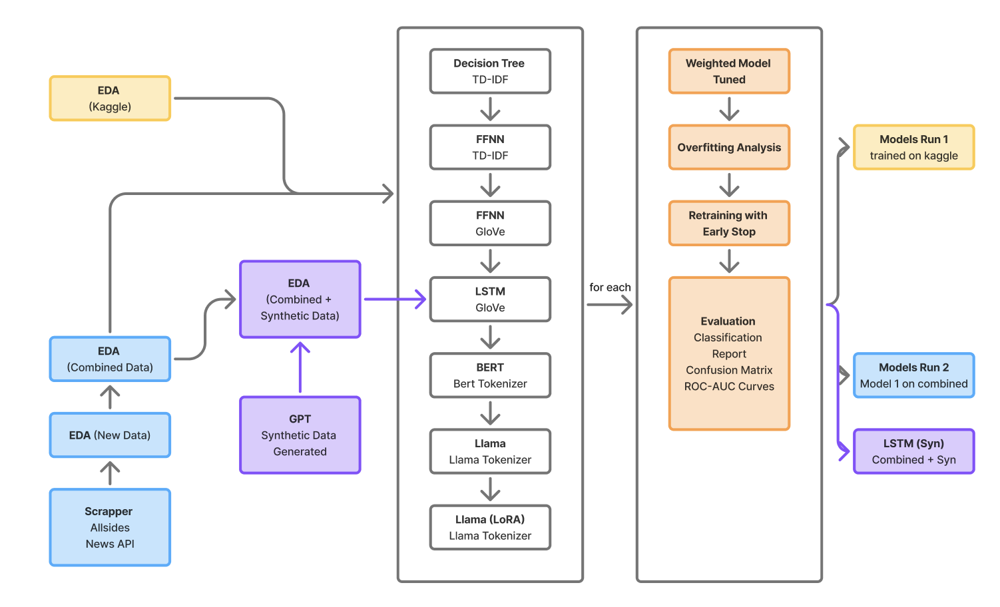

# CS5242Project
AY2024/2025 Sem 2 CS5242 NN and DL Project

Group 10 

Benjamin Lee Jun Cheng A0286163Y

Lai Foong Ming A0268245X

This repo consists of the work done for the group project component in CS5424 Neural Networks and Deep Learning for AY2024/2025 Sem 2 in National University of Singapore (NUS). 

## Use of AI declaration 

Generative AI was used in this project for debugging, troubleshooting and limited code generation. Additionally, a synthetic data generation experiment was conducted with the aid of ChatGPT that is addressed at the end of the report. 

## Project Introduction 

Executive Summary: 
- News media often presents information with varying degrees of political bias. Readers need reliable tools to quickly identify these biases, especially for breaking news, to make informed decisions about the content they consume. Current manual rating systems cannot keep pace with the volume and speed of modern news distribution. We propose developing a classifier capable of analyzing and assigning ratings to articles on demand. This model aims to enhance media literacy by helping users critically assess content in real time.

Problem statements:
- Currently, news rating websites rely on human reviewers to evaluate content. (AllSides, n.d.)(Media Bias/Fact Check, 2025)(Ad Fontes Media, n.d.) 
- These human-based news rating systems are not scalable and have limited efficacy as: 
    - Breaking news is evaluated too late and too slowly to be useful
    - Push notifications and RSS feeds outpace manual review 
    - Rating sites have limited coverage of sources 

Approach: 
- Develop ML-based political bias classifier 

Goal: 
- Enable instant, on-demand bias assessment to enhance media literary

Our video presentation is in the file Video.mp4, and our slides can be found in NN Presentation.pdf.

## Navigating this Repository

Our final project report is available at [report.ipynb](report.ipynb)

Briefly, our project used the kaggle data set political bias [here](https://www.kaggle.com/datasets/mayobanexsantana/political-bias/data) to develop an initial flow that produced Model 1 for each of our chosen models. Additional data was scrapped due to class imbalance and a second model, Model 2, was produced using the combined (augmented) dataset. Details of models are found in the report.

To run the notebooks, please install python 3.12.3. The notebook has been tested with this version and while it may run with other versions, it is untested.

Run the following commands after creating and starting a virtual environment for python:
```python
pip install -r requirements.txt
```

For GloVe implementations, please download the 6B GloVe embeddings. And unzip them in a folder named glove.6B.
```shell
wget https://nlp.stanford.edu/data/glove.6B.zip
```

Please note that to run the worldnewsapi scraper, you will need both A RAPIDAPI account with a KEY in the MBFC api, and a world news API key in constants.py:
```python
WORLDNEWS_API_KEY="APIKEYHERE"
RAPID_API_KEY="APIKEYHERE"
```

 

With reference to our project flow diagram:

1. EDA on original kaggle dataset [EDA.ipynb](EDA.ipynb)
2. EDA on scrapped data from allsides [EDA_allsides.ipynb](EDA_allsides.ipynb)
3. EDA on scrapped data from newsapi [EDA_newsapi.ipynb](EDA_newsapi.ipynb)
4. EDA on kaggle and scrapped data combined [EDA_combined.ipynb](EDA_combined.ipynb)
5. EDA on synthetic data [EDA_syn.ipynb](EDA_syn.ipynb)

Model 1:
1. Decision Tree [decisionTree.ipynb](decisionTree.ipynb)
2. FFNN(TD-IDF) [FFNN.ipynb](FFNN.ipynb)
3. FFNN (GloVe) [FFNN_GloVe.ipynb](FFNN_GloVe.ipynb)
4. LSTM [lstm.ipynb](lstm.ipynb)
5. BERT [bert.ipynb](bert.ipynb)
6. Llama (basic model) [llama_base.ipynb](llama_base.ipynb)
7. Llama (LoRA) [llama_lora.ipynb](llama_lora.ipynb)

Model 2:
1. Decision Tree (TD-IDF) [combined_decisionTree.ipynb](combined_decisionTree.ipynb)
2. FFNN (TD-IDF) [combined_FFNN.ipynb](combined_FFNN.ipynb)
3. FFNN (GloVe) [combined_FFNN_GloVe.ipynb](combined_FFNN_GloVe.ipynb)
4. LSTM [combined_lstm.ipynb](combined_lstm.ipynb)
5. BERT [combined_bert.ipynb](combined_bert.ipynb)
6. Llama [llama_base.ipynb](combined_llama_base.ipynb)
7. Llama (LoRA) [llama_lora.ipynb](combined_llama_lora.ipynb)

Synthetic Data Experiment (Model 3):
1. LSTM with Synthetic data [lstm_syn.ipynb](lstm_syn.ipynb)

Data:
1. All data is in the [data](data) directory
2. All scrappers used are in the [data](data) directory

References: 

	1.	AllSides. (n.d.). Media bias rating methods. AllSides. Retrieved May 2, 2025, from https://www.allsides.com/media-bias/media-bias-rating-methods

	2.	Media Bias/Fact Check. (2025). Methodology. Media Bias/Fact Check. Retrieved May 2, 2025, from https://mediabiasfactcheck.com/methodology/

	3.	Ad Fontes Media. (n.d.). Methodology. Ad Fontes Media. Retrieved May 2, 2025, from https://adfontesmedia.com/methodology/